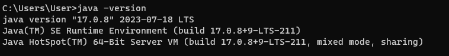
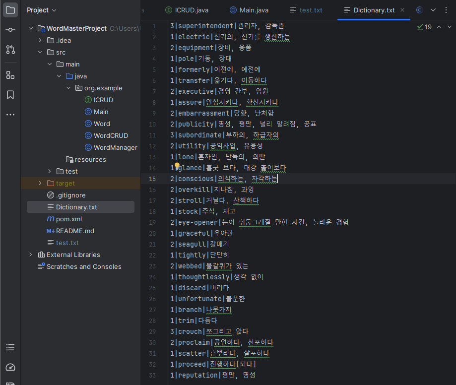

# WordMasterProject
Description:
  This project is a simple CRUD application, that will the user will be able to manipulate as a personal English vocabulary list!

JDK 버전:

기능 실행 확인:

■ [파일 읽기] + 데이터파일(Dictionary.txt) 목록을 보두 다 읽고 등록하였는 기능:
  

  'Dictionary.txt'  파일 단어들:
  

■ [수준별 단어보기] 각 수준에 따라 단어 목록 보기가 잘 실행하는 기능 (1~3)
  

■ [단어검색] 입력한 단어가 포함된 모든 단어를 보여주는 기능
  

■ [단어추가] 단어 새로 추가하는 기능
  
  
■ [단어수정] 단어 검색 후, 특정 단어의 내용을 수정하는 기능
  

■ [단어삭제] 단어 검색 후, 특정 단어를 삭제하는 기능
  

■ [단어 정렬] 단어를 알파펫 혹은 난이도 순으로 정렬해주는 기능 ** 추가 기능
  

■ [파일 저장] 변경된 목록을 데이터파일로 새로 저장하는 기능
  
  
  'test.txt' 파일에 저장된 난이도 순으로 정렬이돤 단어들 확인
  

■ [프로그램 종료] 프로그램 종료하는 기능
  
